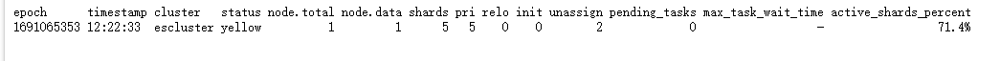
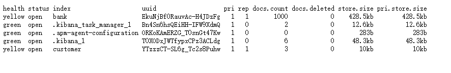
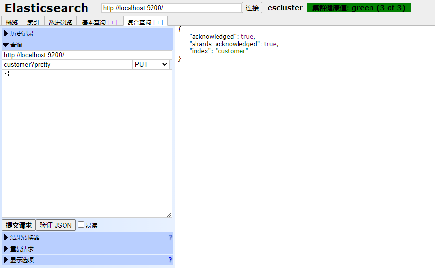
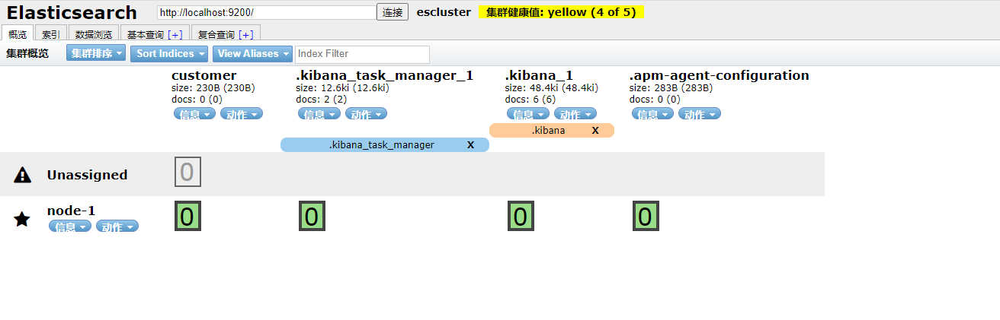

# 快速入门
Elasticsearch是一个可高度伸缩（扩展）的开源数据存储、全文搜索和数据分析引擎。它通常被用于具有复杂搜索功能和分析需求的应用程序的底层引擎。

## 核心概念
### 1. 近实时
Elasticsearch是一个近实时（Near Real Time，NRT）的数据搜索和分析平台。这意味着从索引文档到可搜索文档都会有一段微小 的延迟（通常是1s以内）。

### 2. 集群
集群（cluster）是一个或多个节点（node）的集合，这些节点将共同拥有完整的数据，并跨节点提供联合索引、搜索和分析功能。集群由唯一的名称标识（elasticsearch.yml配置文件中对应参数cluster.name），集群的名称是elasticsearch.yml配置文件中最重要的一个配置参数，默认名称为Elasticsearch，节点只能通过集群名称加入集群。 

请确保不要在不同的环境中使用相同的集群名称，否则可能会导致节点加入错误的集群。例如，可以使用loggingdev、loggingstage和loggingprod来区分开发、预发布和生产环境的集群。

> 注意：只有一个节点的集群是有效的，而且有特殊的用处，尤其是可以在单节点集群进行快速的开发、测试。此外，可以存在多个独立的集群，每个集群都有自己唯一的集群名称。

### 3. 节点
节点（node）是一个Elasticsearch的运行实例，也就是一个进程（process），多个节点组成集群，节点存储数据，并参与集群的索引、搜索和分析功能。与集群一样，节点由一个名称标识，默认情况下， 该名称是在启动时分配给节点的随机通用唯一标识符（UUID）。如果不希望使用默认值，可以定义所需的任何节点名称。此名称对于集群管理很重要，因为在实际应用中需要确定网络中的哪些服务器对应于Elasticsearch集群中的哪些节点。

可以通过集群名称将节点配置为加入特定集群。默认情况下，每个节点都被设置为加入一个名为Elasticsearch的集群，这意味着，如果在网络上启动了多个节点，并且假设它们可以彼此发现，那么它们都将自动形成并加入一个名为Elasticsearch的集群。

在单个集群中，可以有任意多个节点。此外，如果当前网络上没有其他Elasticsearch节点在运行，则默认情况下，启动单个节点将形成一个名为Elasticsearch的新单节点集群。

> 注意：上面提到了节点实质是一个进程，因此服务器和节点可以是一对多的关系。还有一点需谨记，无论是开发环境、测试环境还是生产环境请配置有意义的节点名称。


### 4. 索引
索引（index）是具有某种相似特性的文档集合。例如，可以有存储客户数据的索引，存储产品目录的索引，以及存储订单数据的索引。索引由一个名称（必须全部是小写）标识，当对其中的文档执行索引、搜索、更新和删除操作时，该名称指向这个特定的索引。

在单个集群中，可以定义任意多个索引。

### 5. 类型
类型（type）这个概念在7.0版本以后已被彻底移除。

### 6. 文档
文档（document）是可以被索引的基本信息单元。例如，可以为单个客户创建一个文档，为单个产品创建另一个文档，以及为单个订单创建另一个文档。文档以JSON表示，JSON是一种普遍存在的Internet数据交换格式。在单个索引中，理论上可以存储任意多的文档。

### 7. 分片和副本
索引可能会存储大量数据，这些数据可能会超出单个节点的硬件限制。例如，占用1TB磁盘空间的10亿个文档的单个索引可能超出单个节点的磁盘容量，或者速度太慢，无法满足搜索请求的性能要求。

为了解决这个问题，Elasticsearch提供了将索引水平切分为多段（称为分片，shard）的能力。创建索引时，只需定义所需的分片数量。每个分片本身就是一个具有完全功能的独立“索引”，可以分布在集群中的任何节点上。

分片很重要，主要有两个原因：
- 分片可以水平拆分数据，实现大数据存储和分析。
- 可以跨分片（可能在多个节点上）进行分发和并行操作，从而提高性能和吞吐量。

如何分配分片以及如何将其文档聚合回搜索请求的机制完全由Elasticsearch管理，并且对用户是透明的。

在随时可能发生故障的网络或云环境中，如果某个分片或节点以某种方式脱机或因何种原因丢失，则强烈建议用户使用故障转移机制。为此，Elasticsearch提出了将索引分片复制一个或多个拷贝，称为副本（replica）。

副本很重要，主要有两个原因：
- 副本在分片或节点发生故障时提供高可用性。因此，需要注意的是，副本永远不会分配到复制它的原始主分片所在的节点上。也就是分片和对应的副本不可在同一节点上。这很容易理解，如果副本和分片在同一节点上，当机器发生故障时会同时丢失，起不到容错的作用。
- 通过副本机制，可以提高搜索性能和水平扩展吞吐量，因为可以在所有副本上并行执行搜索。

总之，每个索引可以分割成多个分片。每个分片可以有零个或多个副本。

可以在创建索引时为每个索引定义分片和副本的数量。创建索引后，还可以随时动态更改副本的数量。分片的数量理论上不可变更，唯一的办法重建索引，重新定义分片数量。但还是可以使用_shrink和_split API更改索引的分片数量，但这不是通常的做法，预先评估准确的分片数量才是最佳方法。

默认情况下，Elasticsearch中的每个索引都分配一个主分片和一个副本，这意味着如果集群中至少有两个节点，则索引将有一个主分片和另一个副本分片（一个完整副本），每个索引总共有两个分片。

> 知识点：其实每个Elasticsearch分片都是一个完整的Lucene索引。在一个Lucene索引中，可以有大量的文档。从Lucene-5843起，限制为2 147 483 519（=integer.max_value-128）个文档。可以使用_cat/shards api监视分片大小。

> 注意：分片和副本机制是Elasticsearch实现分布式、水平扩展、高并发、高容错功能的核心。通过分片机制实现大数据的分布式存储，通过副本机制实现了集群的容错、高性能和水平扩展。Elastic是弹性、可伸缩的意思，Elasticsearch的弹性、可伸缩性是建立在分片和副本的基础上的。 


## 安装部署

## 使用
Elasticsearch提供了一个非常全面和强大的REST API，可以使用它与集群进行交互。使用API执行的操作如下：
- 检查集群、节点和索引的运行状况、状态和统计信息。
- 管理集群、节点和索引数据和元数据。
- 对索引执行CRUD（创建、读取、更新和删除）和搜索操作。
- 执行高级搜索操作，如分页、排序、过滤、脚本、聚合和其他操作。

### 集群健康信息
健康检查API用来查看集群的运行情况。可以使用Curl来实现这一点，也可以使用任何允许进行HTTP/REST调用的工具。现在在启动Elasticsearch的节点上打开另一个命令shell窗口。

为了检查集群的运行状况，可以使用_cat API。

```shell
curl-X GET"localhost:9200/_cat/health?v"
```
请求结果


集群的健康状态有绿色（ green ） 、黄色（ yellow ） ， 红色 （red）三种：
- 绿色：一切正常（集群功能全部可用）。
- 黄色：所有数据都可用，但某些副本尚未分配（集群完全正常工作）。
- 红色：由于某些原因，某些数据不可用（集群只有部分功能正常工作）。

> 注意：当集群为红色时，可用的分片可以继续提供搜索请求，但需要尽快修复它，因为存在未分配的分片。

### 列出集群中的索引信息
```shell
GET/_cat/indices?v
```
执行结果


### 创建索引
创建一个名为customer的索引, 本例中使用elasticsearch head插件创建
```shell
PUT /customer?pretty
```


创建之后在概览中可以看到该索引的信息



该索引有一个黄色的健康标签。黄色意味着一些副本尚未分配。此索引发生这种情况的原因是，默认情况下，Elasticsearch为此索引创建了一个副本。因为目前只有一个节点在运行，所以在另一个节点加入集群之前，还不能分配一个副本（为了高可用性）。一旦该副本分配到第二个节点上，该索引的运行状况将变为绿色。

### 索引和查询文档
现在把一些数据放到customer索引中，在该索引中索引一个简单的文档，其ID为1，示例代码如下所示（为了便于执行POST和PUT请求，后面有时会用postman工具，同样略去IP部分）。
> 注意： 一定要把/config/elasticsearch.yml 文件中的network.host属性值改为本机IP，这样才可以在其他机器上访问Elasticsearch服务，后面会详细讲解配置。

```shell
PUT customer/_doc/1?pretty
{
  "name": "John Doe"
}
```
执行成功返回值
```json
{
  "_index": "customer",
  "_type": "_doc",
  "_id": "1",
  "_version": 1,
  "result": "created",
  "_shards": {
    "total": 2,
    "successful": 1,
    "failed": 0
  },
  "_seq_no": 0,
  "_primary_term": 1
}
```
可以看到在customer索引中成功地创建了一个新的文档。文档还有一个内部ID是1，这是索引时指定的。

需要注意的是，Elasticsearch并不要求在索引文档之前先显式地创建索引。如果customer索引之前不存在，那么Elasticsearch将自动创建该索引。

检索索引的文档：
```shell
GET customer/_doc/1?pretty
{}
```
执行结果
```json
{
  "_index": "customer",
  "_type": "_doc",
  "_id": "1",
  "_version": 1,
  "_seq_no": 0,
  "_primary_term": 1,
  "found": true,
  "_source": {
    "name": "John Doe"
  }
}
```

除了一个字段之外，这里没有发现任何异常的地方，说明找到了一个ID为1的文档和另一个字段_source，它返回了索引的完整JSON文档。

### 删除索引
删除刚刚创建的索引：
```shell
DELETE customer?pretty
```
执行结果
```json
{
  "acknowledged": true
}
```

在Elasticsearch中如何访问数据的模式。这种模式可以概括如下：

`<HTTP Verb>/<Index>/<Endpoint>/<ID>`

这种REST访问模式在所有API命令中都非常普遍。

## 修改数据
Elasticsearch提供近实时的数据操作和搜索功能。默认情况下，从索引、更新、删除数据到在搜索结果中显示数据，会有少于1s的延迟（刷新间隔）。这是与其他平台（如SQL）的一个重要区别，在SQL中，数据在事务完成后立即可用。

### 索引和覆盖文档
上面示例中，将指定的文档索引到customer索引中，ID为1。如果用不同的（或相同的）文档再次执行上述命令，那么Elasticsearch将在现有文档的基础上替换（即重新索引）一个ID为1的新文档：
```shell
PUT customer/_doc/1?pretty
{
  "name": "Jane Doe"
}
```
执行结果
```json
{
  "_index": "customer",
  "_type": "_doc",
  "_id": "1",
  "_version": 2,
  "result": "not_found",
  "_shards": {
    "total": 1,
    "successful": 1,
    "failed": 0
  },
  "_seq_no": 1,
  "_primary_term": 1
}
```

索引时，ID部分是可选的。如果没有指定，Elasticsearch将生成一个随机ID，然后使用它为文档编制索引。Elasticsearch生成的实际ID（或在前面的示例中显式指定的任何内容）作为索引API调用的一部分返回。 

不显式ID的文档：
```shell
POST customer/_doc?pretty
{
  "name": "Jane Doe"
}
```
返回值
```json
{
  "_index": "customer",
  "_type": "_doc",
  "_id": "Y-y-u4kBG6nbi_p_bOt_",
  "_version": 1,
  "result": "created",
  "_shards": {
    "total": 1,
    "successful": 1,
    "failed": 0
  },
  "_seq_no": 0,
  "_primary_term": 1
}
```

> 注意：在上面的例子中，使用了POST动词而不是PUT，这是因为没有指定ID。一般情况下POST和PUT是可以互换的。


### 更新文档
Elasticsearch除了能够索引和替换文档外，还可以更新文档。Elasticsearch 实际上并不是进行就地更新， 每当进行更新时，Elasticsearch会删除旧文档，然后索引一个新文档，但这对用户来说是一次调用。实际上Elasticsearch的数据存储结构决定了其不能像关系数据库那样进行字段级的更新，所有的更新都是先删除旧文档，再插入一条新文档，但这个过程对用户来说是透明的。

下面示例显示如何通过将名称字段更改为Jane Doe来更新以前的文档（ID为1）：
```shell
POST customer/_doc/1?pretty
{
  "doc": {
    "name": "Jane Doe"
  }
}
```

下面示例演示如何通过将名称字段更改为Jane Doe来更新以前的文档（ID为1），同时向其添加年龄字段：
```shell
POST customer/_update/1?pretty
{
  "doc": {
    "name": "Jane Doe",
    "age": 20
  }
}
```
返回值
```json
{
  "_index": "customer",
  "_type": "_doc",
  "_id": "1",
  "_version": 2,
  "result": "updated",
  "_shards": {
    "total": 1,
    "successful": 1,
    "failed": 0
  },
  "_seq_no": 3,
  "_primary_term": 1
}
```

也可以使用简单的脚本执行更新。下面示例使用脚本将年龄增加5：
```shell
POST customer/_update/1?pretty
{
  "script" : "ctx._source.age += 5"
}
```
在上面的示例中，ctx._source指的是将要更新的当前源文档。
Elasticsearch提供了在给定查询条件（如SQL update-where语句）下更新多个文档的功能。后面会有专门的章节讲解。


### 删除文档
删除文档相当简单。下面示例显示如何删除ID为2的客户
```shell
DELETE customer/_doc/2?pretty
```